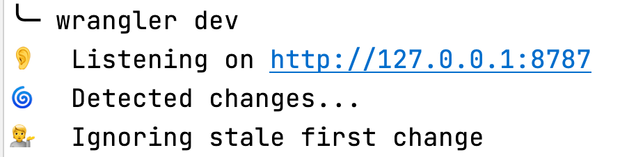
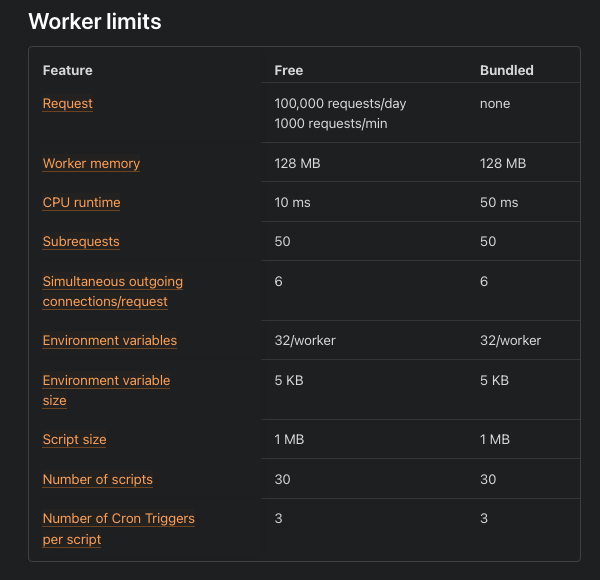

# archipelago

Cloudflare Workers provides a serverless execution environment that allows you to create entirely new applications
or augment existing ones without configuring or maintaining infrastructure.

## Requirements

- [Nodejs](https://nodejs.org/en/)

> verify installation: `node -v`

- [Git](https://git-scm.com/)

> verify installation: `git -v`

- [Lerna](https://lerna.js.org/) -> `npm install -g lerna`

> verify installation: `lerna -v`

- [Sign up at Cloudflare Workers](https://dash.cloudflare.com/sign-up/workers)

## Getting started

- `npm install -g @cloudflare/wrangler`

- `wrangler --version`

## Creating a new worker

`cd packages`

`wrangler generate my-worker` //<- define the worker name here

`cd my-worker`

`wangler dev` //<- test locally



## Coding

[Examples](https://developers.cloudflare.com/workers/examples)

[Tutorials](https://developers.cloudflare.com/workers/tutorials)

The starter point of the Worker is **index.js** but Cloudflare Workers also 
[supports other languages](https://developers.cloudflare.com/workers/platform/languages)

For this project was are using JavaScript only since we are managing the project with Lerna.

## Deployment

We use Lerna locally and publish all workers at once, so you need to update your `package.json` with entries for "build"
and "publish", but these entries are not needed for testing a single worker. 

```
lerna run publish
```

We use a GitHub Action to deploy on merge to main branch but each worker deployment is separate. 

So you will also need to update the workflow **wrangler.yml** and add another entry for your worker, take the example
of `john/package.json`.

Example **.github/workflows/wrangler.yml**

```yml
my-worker:
  runs-on: ubuntu-latest
  name: my-worker
  steps:
    - uses: actions/checkout@v2
    - name: Publish
      uses: cloudflare/wrangler-action@1.3.0
      with:
        apiToken: ${{ secrets.CF_API_TOKEN }}
        workingDirectory: "packages/my-worker"
```

Using this example you can change all strings 'my-worker' for your worker name (you need to add it at **jobs:** scope).

## Workers Platform



## Pseudo Websites with Workers Free 🍬 💃 🕺 😎 

- [Deliver an HTML page from an HTML string directly inside the Worker script](https://developers.cloudflare.com/workers/examples/return-html)
- [JavaScript](https://developer.mozilla.org/en-US/docs/Web/javascript)
- [Node Version Manager - POSIX-compliant bash script to manage multiple active node.js versions](https://github.com/nvm-sh/nvm)
- [Ubuntu on WSL - Install a complete Ubuntu terminal environment in minutes on Windows 10 with Windows Subsystem for Linux (WSL)](https://ubuntu.com/wsl)
- [VirtualBox is a powerful x86 and AMD64/Intel64 virtualization product for enterprise as well as home use](https://www.virtualbox.org/)
- [Chrome Canary - Nightly build for developers. Get on the bleeding edge of the web. Be warned: Canary can be unstable](https://www.google.com/chrome/canary/)
- [Firefox Browser Developer Edition](https://www.mozilla.org/en-US/firefox/developer/)
- [Get a faster, better browser. Opera's free VPN, Ad Blocker, integrated messengers and private mode help you browse securely and smoothly. Share files instantly between your desktop and mobile browsers and experience web 3.0 with a free cryptowallet](https://www.opera.com/)
- [The Open Graph protocol](https://ogp.me/)
- [Twitter Cards](https://developer.twitter.com/en/docs/twitter-for-websites/cards/overview/abouts-cards)  
- [How structured data works](https://developers.google.com/search/docs/guides/intro-structured-data)
- [HTML 5](https://developer.mozilla.org/en-US/docs/Web/Guide/HTML/HTML5)
- [<script>: The Script element](https://developer.mozilla.org/en-US/docs/Web/HTML/Element/script)
- [<style>: The Style Information element](https://developer.mozilla.org/en-US/docs/Web/HTML/Element/style)  
- [Base64 image encoding](https://developer.mozilla.org/en-US/docs/Web/HTTP/Basics_of_HTTP/Data_URIs)
- [Base64 encoding audio content](https://cloud.google.com/speech-to-text/docs/base64-encoding)
- [WebP is a modern image format that provides superior lossless and lossy compression for images on the web. Using WebP, webmasters and web developers can create smaller, richer images that make the web faster](https://developers.google.com/speed/webp/)  
- [The Canvas API provides a means for drawing graphics via JavaScript and the HTML](https://developer.mozilla.org/en-US/docs/Web/API/Canvas_API)
- [Facebook Sharing Debugger](https://developers.facebook.com/tools/debug/)
- [Preview and Generate Open Graph Meta Tags](https://www.opengraph.xyz/)
- [Rich Results Test](https://search.google.com/test/rich-results)  
- [Structured Data Testing Tool - Google](https://search.google.com/structured-data/testing-tool)
- [The W3C Markup Validation Service](https://validator.w3.org/)
- [GTmetrix | Website Speed and Performance Optimization](https://gtmetrix.com/)
- [PageSpeed Insights - Google Developers](https://developers.google.com/speed/pagespeed/insights/)
- [YouTube](https://www.youtube.com/)
- [Emoji cheat sheet](https://github.com/WebpageFX/emoji-cheat-sheet.com)
- [Typer.js](https://steven.codes/typerjs/)
- [EditorConfig](https://editorconfig.org/)
- [Convert your images to base64](https://www.base64-image.de/)
- [GIF to base64 converter](https://onlineimagetools.com/convert-gif-to-base64)
- [Content delivery network](https://en.wikipedia.org/wiki/Content_delivery_network)
- [GitHub Desktop | Simple collaboration from your desktop](https://desktop.github.com/)
- [Free Git GUI for Windows, Mac, Linux | GitKraken](https://www.gitkraken.com/)
- [Git GUI Clients](https://git-scm.com/downloads/guis)  
- [gitk - The Git repository browser](https://git-scm.com/docs/gitk)
- [git-gui - A portable graphical interface to Git](https://git-scm.com/docs/git-gui) 
- [gitg is a graphical user interface for git](https://gitlab.gnome.org/GNOME/gitg)  
- [Homebrew - The Missing Package Manager for macOS (or Linux)](https://brew.sh/)
- [GitHub Actions - Automate your workflow from idea to production](https://github.com/features/actions)
- [JSON (JavaScript Object Notation) is a lightweight data-interchange format](http://www.json.org/json-en.html)
- [Markdown](https://daringfireball.net/projects/markdown/)
- [YAML Ain't Markup Language](https://yaml.org/)
- [TOML - Tom's Obvious, Minimal Language (and friends)](https://github.com/toml-lang)
- [A media type (formerly known as MIME type)](https://en.wikipedia.org/wiki/Media_type)  
- [The Dublin Core, also known as the Dublin Core Metadata Element Set, is a set of fifteen "core" elements (properties) for describing resources](https://en.wikipedia.org/wiki/Dublin_Core)  
- [A favicon (/ˈfæv.ɪˌkɒn/; short for favorite icon), also known as a shortcut icon, website icon, tab icon, URL icon, or bookmark icon, is a file containing one or more small icons, associated with a particular website or web page](https://en.wikipedia.org/wiki/Favicon)
- [gitignore - Specifies intentionally untracked files to ignore](https://git-scm.com/docs/gitignore)

## Islands

- [John](https://john.roquesbeach.workers.dev/)
