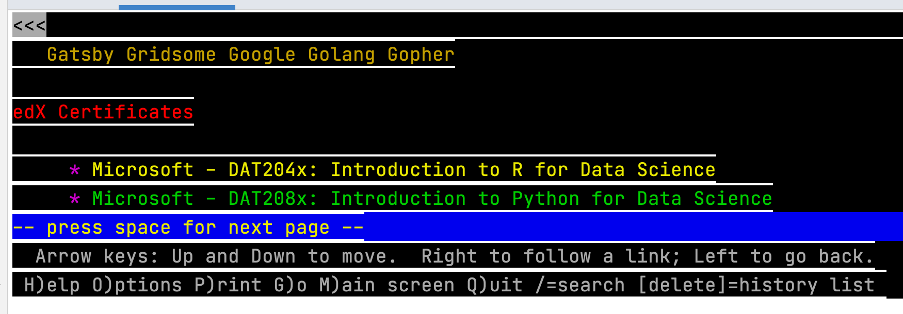

<div dir="rtl">

[English](../../README.md)
[Arabic](README.md)
[Spanish](../es/README.md)

[Cloudflare Workers](https://workers.cloudflare.com/) يوفر العمال بيئة تنفيذ بدون خادم تتيح لك إنشاء تطبيقات جديدة تمامًا أو زيادة التطبيقات الحالية دون تكوين البنية التحتية أو صيانتها..

## المتطلبات

- [Node.js](https://nodejs.org/en/)

> تحقق من التثبيت: `node -v`

- [Git](https://git-scm.com/)

> تحقق من التثبيت: `git --version`

- [Lerna](https://lerna.js.org/) -> `npm install -g lerna`

> تحقق من التثبيت: `lerna -v`

## الخطوات الأولى

يمكنك التسجيل في [sign up at Cloudflare Workers](https://dash.cloudflare.com/sign-up/workers) باستخدام حسابك الخاص مجانًا وتجربة نموذج التعليمات البرمجية في
[Playground](https://developers.cloudflare.com/workers/learning/playground). سيكون استخدام الجانب الإداري لحساب Cloudflare Workers أسهل طريقة لنشر العمال دون استخدام Wrangler CLI
[Wrangler CLI](https://developers.cloudflare.com/workers/cli-wrangler).

## البدء

- `npm install -g @cloudflare/wrangler`

- `wrangler --version`

## انشاء عامل جديد

```shell
cd حزم
رانجلر توليد العامل
cd العامل الخاص بي
```

ظرًا لأننا نبني جميع العمال تحت حساب واحد ونطاق فرعي `roquesbeach.workers.dev` يجب عليك ملء
[wrangler.toml](packages/john/wrangler.toml) ب

```toml
account_id = "9ce3889ba6eb93d1a68f191e1ac67c01"
```

ثم لاختبار العامل محليًا

```shell
wrangler dev
```


## الترميز

[أمثلة](https://developers.cloudflare.com/workers/examples)

[دروس](https://developers.cloudflare.com/workers/tutorials)

The starter point of the Worker is **index.js** but Cloudflare Workers also
[دعم لغات أخرى](https://developers.cloudflare.com/workers/platform/languages).

بالنسبة لهذا المشروع ، نحن نستخدم JavaScript فقط لأننا ندير المشروع مع Lerna.

## تعيين

نستخدم Lerna محليًا لنشر جميع العمال في وقت واحد, لذلك تحتاج إلى تحديث `package.json` بإدخالات
`بناء` و `نشر`, ولكن هذه الإدخالات ليست ضرورية لنشر عامل واحد.

من جذر المستودع يمكن للمسؤولين تشغيله

```shell
lerna run publish
```


يمكن للمسؤولين أيضًا نشر عامل واحد. `cd` إلى دليله وتشغيله

```shell
wrangler publish
```


نستخدم إجراء GitHub للنشر عند الدمج إلى الفرع الرئيسي ولكن كل عملية نشر للعمال منفصلة.

لذلك ستحتاج أيضًا إلى تحديث مسار العمل [**wrangler.yml**](.github/workflows/wrangler.yml) وإضافة إدخال آخر لموظفك, خذ مثال[packages/john/package.json](packages/john/package.json).

مثال **.github/workflows/wrangler.yml**

```yaml
العامل الخاص بي:
  يشتغل على: ubuntu-latest
  الاسم: 🧘 العامل الخاص بي
  الخطوات:
    - يستخدم: حركات/خروج@v2
    - الاسم: 🚀 نشر
      يستخدم: cloudflare/wrangler-action@1.3.0
      مع:
        apiToken: ${{ secrets.CF_API_TOKEN }}
        workingDirectory: "packages/my-worker"
```

استخدام هذا المثال ، يمكنك تغيير جميع السلاسل الخاصة ب `العامل الخاص بي` لأسم العامل الخاص بك (يجب ان تضاف الى **الوظائف:** scope).

## منصة العاملين


## مواقع الويب الزائفة مع العمال مجانًا 🍬 💃 🕺 😎

</div>

- [Deliver an HTML page from an HTML string directly inside the Worker script](https://developers.cloudflare.com/workers/examples/return-html)
- [JavaScript (JS) is a lightweight, interpreted, or just-in-time compiled programming language with first-class functions. While it is most well-known as the scripting language for Web pages, many non-browser environments also use it, such as Node.js, Apache CouchDB and Adobe Acrobat](https://developer.mozilla.org/en-US/docs/Web/javascript)
- [pre-commit - A framework for managing and maintaining multi-language pre-commit hooks](https://pre-commit.com/)
- [Jekyll - Transform your plain text into static websites and blogs](https://jekyllrb.com/)
- [Minima is a one-size-fits-all Jekyll theme for writers](https://github.com/jekyll/minima)
- [A Jekyll plugin for rendering GitHub avatars](https://github.com/benbalter/jekyll-avatar)
- [GitHub-flavored Emoji plugin for Jekyll](https://github.com/jekyll/jemoji/)
- [🔀 Seamlessly specify multiple redirections URLs for your pages and posts with Jekyll](https://github.com/jekyll/jekyll-redirect-from)
- [Jekyll plugin to silently generate a sitemaps.org compliant sitemap for your Jekyll site](https://github.com/jekyll/jekyll-sitemap)
- [📝 A Jekyll plugin to generate an Atom (RSS-like) feed of your Jekyll posts](https://github.com/jekyll/jekyll-feed/)
- [Jekyll Mentions - @mentionable support for your Jekyll site](https://github.com/jekyll/jekyll-mentions)
- [A Jekyll plugin to add metadata tags for search engines and social networks to better index and display your site's content](https://github.com/jekyll/jekyll-seo-tag)
- [Bundler provides a consistent environment for Ruby projects by tracking and installing the exact gems and versions that are needed. Bundler is an exit from dependency hell, and ensures that the gems you need are present in development, staging, and production. Starting work on a project is as simple as bundle install](https://bundler.io/)
- [Patch-level verification for Bundler](https://github.com/rubysec/bundler-audit)
- [interactive Ruby](https://github.com/ruby/irb)
- [Pry - A runtime developer console and IRB alternative with powerful introspection capabilities](https://github.com/pry/pry/)
- [GitHub Pages - Websites for you and your projects](https://pages.github.com/)
- [Mozilla XML Namespace - MozSearch plugin format](https://www.mozilla.org/2006/browser/search/)
- [The OpenSearch description format lets a website describe a search engine for itself, so that a browser or other client application can use that search engine. OpenSearch is supported by (at least) Firefox, Edge, Internet Explorer, Safari, and Chrome. (See Reference Material for links to other browsers' documentation)](https://developer.mozilla.org/en-US/docs/Web/OpenSearch)
- [ESLint is a static code analysis tool for identifying problematic patterns found in JavaScript code. It was created by Nicholas C. Zakas in 2013. Rules in ESLint are configurable, and customized rules can be defined and loaded. ESLint covers both code quality and coding style issues](https://eslint.org/)
- [V8 is Google’s open source high-performance JavaScript and WebAssembly engine, written in C++. It is used in Chrome and in Node.js, among others](https://v8.dev/)
- [npm is a package manager for the JavaScript programming language. npm, Inc. is a subsidiary of GitHub, an American multinational corporation that provides hosting for software development and version control with the usage of Git. It is the default package manager for the JavaScript runtime environment Node.js](https://www.npmjs.com/)
- [Node Version Manager - POSIX-compliant bash script to manage multiple active node.js versions](https://github.com/nvm-sh/nvm)
- [Ubuntu on WSL - Install a complete Ubuntu terminal environment in minutes on Windows 10 with Windows Subsystem for Linux (WSL)](https://ubuntu.com/wsl)
- [VirtualBox is a powerful x86 and AMD64/Intel64 virtualization product for enterprise as well as home use](https://www.virtualbox.org/)
- [Chrome Canary - Nightly build for developers. Get on the bleeding edge of the web. Be warned: Canary can be unstable](https://www.google.com/chrome/canary/)
- [Firefox Browser Developer Edition](https://www.mozilla.org/en-US/firefox/developer/)
- [Get a faster, better browser. Opera's free VPN, Ad Blocker, integrated messengers and private mode help you browse securely and smoothly. Share files instantly between your desktop and mobile browsers and experience web 3.0 with a free cryptowallet](https://www.opera.com/)
- [Lynx is a customizable text-based web browser for use on cursor-addressable character cell terminals. As of 2020, it is the oldest web browser still being maintained, having started in 1992](http://lynx.browser.org/)
- [The Open Graph protocol](https://ogp.me/)
- [Twitter Cards](https://developer.twitter.com/en/docs/twitter-for-websites/cards/overview/abouts-cards)
- [How structured data works](https://developers.google.com/search/docs/guides/intro-structured-data)
- [HTML 5](https://developer.mozilla.org/en-US/docs/Web/Guide/HTML/HTML5)
- [The Script element](https://developer.mozilla.org/en-US/docs/Web/HTML/Element/script)
- [The Style Information element](https://developer.mozilla.org/en-US/docs/Web/HTML/Element/style)
- [Base64 image encoding](https://developer.mozilla.org/en-US/docs/Web/HTTP/Basics_of_HTTP/Data_URIs)
- [Base64 encoding audio content](https://cloud.google.com/speech-to-text/docs/base64-encoding)
- [WebP is a modern image format that provides superior lossless and lossy compression for images on the web. Using WebP, webmasters and web developers can create smaller, richer images that make the web faster](https://developers.google.com/speed/webp/)
- [The Canvas API provides a means for drawing graphics via JavaScript and the HTML](https://developer.mozilla.org/en-US/docs/Web/API/Canvas_API)
- [Facebook Sharing Debugger](https://developers.facebook.com/tools/debug/)
- [Preview and Generate Open Graph Meta Tags](https://www.opengraph.xyz/)
- [Rich Results Test](https://search.google.com/test/rich-results)
- [Structured Data Testing Tool - Google](https://search.google.com/structured-data/testing-tool)
- [The W3C Markup Validation Service](https://validator.w3.org/)
- [GTmetrix - Website Speed and Performance Optimization](https://gtmetrix.com/)
- [PageSpeed Insights - Google Developers](https://developers.google.com/speed/pagespeed/insights/)
- [YouTube](https://www.youtube.com/)
- [Emoji cheat sheet](https://github.com/WebpageFX/emoji-cheat-sheet.com)
- [Emojipedia](https://emojipedia.org)
- [Typer.js](https://steven.codes/typerjs/)
- [EditorConfig helps maintain consistent coding styles for multiple developers working on the same project across various editors and IDEs](https://editorconfig.org/)
- [Portable Network Graphics is a raster-graphics file format that supports lossless data compression. PNG was developed as an improved, non-patented replacement for Graphics Interchange Format. PNG supports palette-based images, grayscale images, and full-color non-palette-based RGB or RGBA images](https://en.wikipedia.org/wiki/Portable_Network_Graphics)
- [Convert your images to base64](https://www.base64-image.de/)
- [GIF to base64 converter](https://onlineimagetools.com/convert-gif-to-base64)
- [Content delivery network](https://en.wikipedia.org/wiki/Content_delivery_network)
- [GitHub Desktop - Simple collaboration from your desktop](https://desktop.github.com/)
- [Free Git GUI for Windows, Mac, Linux - GitKraken](https://www.gitkraken.com/)
- [Git GUI Clients](https://git-scm.com/downloads/guis)
- [gitk - The Git repository browser](https://git-scm.com/docs/gitk)
- [git-gui - A portable graphical interface to Git](https://git-scm.com/docs/git-gui)
- [gitg is a graphical user interface for git](https://gitlab.gnome.org/GNOME/gitg)
- [Take GitHub to the command line. GitHub CLI brings GitHub to your terminal. Free and open source](https://cli.github.com/)
- [Homebrew - The Missing Package Manager for macOS (or Linux)](https://brew.sh/)
- [GitHub Actions - Automate your workflow from idea to production](https://github.com/features/actions)
- [JSON (JavaScript Object Notation) is a lightweight data-interchange format](http://www.json.org/json-en.html)
- [Markdown is a lightweight markup language with plain-text-formatting syntax, created in 2004 by John Gruber and Aaron Swartz. Markdown is often used for formatting readme files, for writing messages in online discussion forums, and to create rich text using a plain text editor](https://daringfireball.net/projects/markdown/)
- [YAML Ain't Markup Language](https://yaml.org/)
- [TOML - Tom's Obvious, Minimal Language (and friends)](https://github.com/toml-lang)
- [A media type (formerly known as MIME type)](https://en.wikipedia.org/wiki/Media_type)
- [The Dublin Core, also known as the Dublin Core Metadata Element Set, is a set of fifteen "core" elements (properties) for describing resources](https://en.wikipedia.org/wiki/Dublin_Core)
- [A favicon (/ˈfæv.ɪˌkɒn/; short for favorite icon), also known as a shortcut icon, website icon, tab icon, URL icon, or bookmark icon, is a file containing one or more small icons, associated with a particular website or web page](https://en.wikipedia.org/wiki/Favicon)
- [Sublime Text is a sophisticated text editor for code, markup and prose](https://www.sublimetext.com/)
- [Atom is a free and open-source text and source code editor for macOS, Linux, and Microsoft Windows with support for plug-ins written in Javascript, and embedded Git Control, developed by GitHub. Atom is a desktop application built using web technologies](https://atom.io/)
- [GNU Emacs is a free software text editor. It was created by GNU Project founder Richard Stallman. In common with other varieties of Emacs, GNU Emacs is extensible using a Turing complete programming language. GNU Emacs has been called "the most powerful text editor available today"](https://www.gnu.org/software/emacs/)
- [GNU nano is a text editor for Unix-like computing systems or operating environments using a command line interface. It emulates the Pico text editor, part of the Pine email client, and also provides additional functionality. Unlike Pico, nano is licensed under the GNU General Public License. Released as free software by Chris Allegretta in 1999, nano became part of the GNU Project in 2001.](https://www.nano-editor.org/)
- [GNU Midnight Commander is a free cross-platform orthodox file manager. It was started by Miguel de Icaza in 1994 as a clone of the then-popular Norton Commander. GNU Midnight Commander is part of the GNU project and is licensed under the terms of the GNU General Public License](http://midnight-commander.org/)
- [GIMP - GNU Image Manipulation Program. GIMP is a free and open-source raster graphics editor used for image manipulation and image editing, free-form drawing, transcoding between different image file formats, and more specialized tasks. GIMP is released under GPLv3+ license and is available for Linux, macOS, and Microsoft Windows](https://www.gimp.org/)
- [Vim is a highly configurable text editor built to make creating and changing any kind of text very efficient. It is included as "vi" with most UNIX systems and with Apple OS X](https://www.vim.org/)
- [Rex eats regular expressions for breakfast. And so can you! This regex tutorial, one of the most detailed on the web, takes you all the way to mastery](http://www.rexegg.com/)
- [gitignore - Specifies intentionally untracked files to ignore](https://git-scm.com/docs/gitignore)
- [GitHub Octodex. Playground and home for all octocats](https://octodex.github.com/)



## Caribbean Sea 🦭 🦑 🦈 🐙

- [archipelago](https://roquesbeach.github.io/archipelago/)

## Islands 🐡 🐠 🐟 ♓ ⛵ 🏊 🏖️

- [John](https://john.roquesbeach.workers.dev/)
- [Images](https://images.roquesbeach.workers.dev/)
- [Random](https://random.roquesbeach.workers.dev/)
