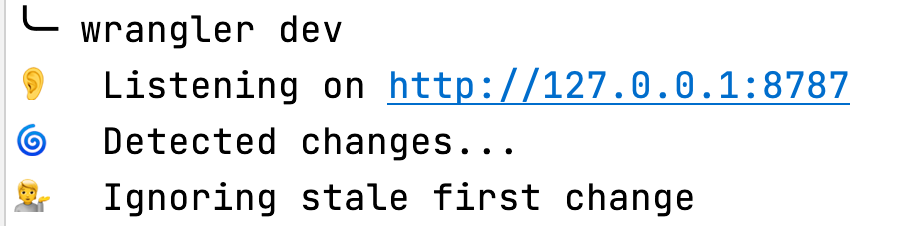
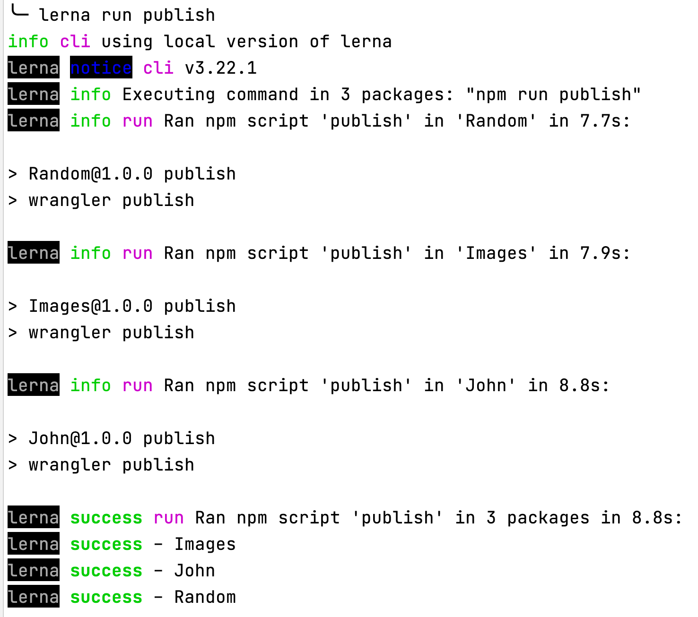
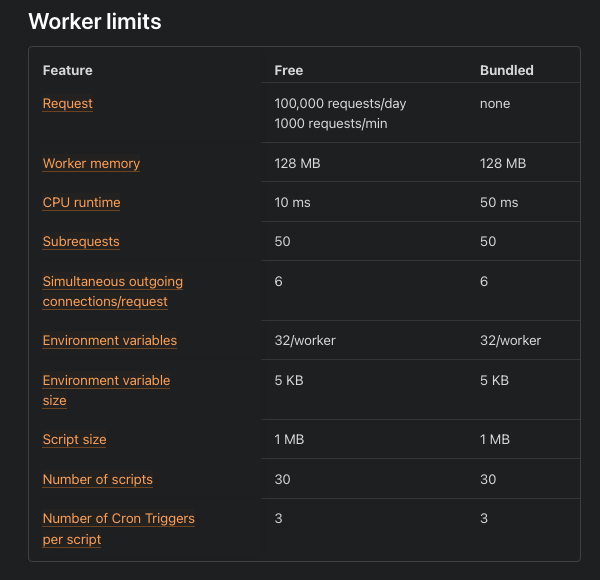
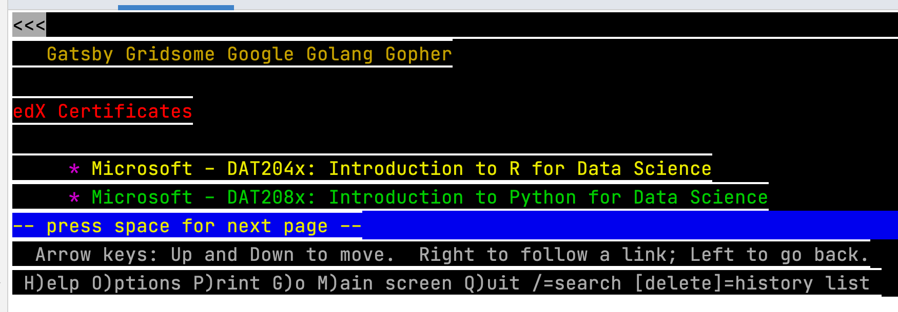

[English](../../README.md)
[Arabic](../ar/README.md)
[Spanish](README.md)

[](https://roquesbeach.github.io/archipelago/)
[](https://john.roquesbeach.workers.dev/)
[](https://images.roquesbeach.workers.dev/)
[](https://random.roquesbeach.workers.dev/)

[Cloudflare Workers](https://workers.cloudflare.com/) Brinda un entorno de ejecución libre de servidores que permite crear aplicaciones completamente nuevas o ampliar las existentes sin necesidad de configurar o mantener una infraestructura.

## Requerimientos

- [Node.js](https://nodejs.org/en/)

> verificar su instalación: `node -v`

- [Git](https://git-scm.com/)

> verificar su instalación: `git --version`

- [Lerna](https://lerna.js.org/) -> `npm install -g lerna`

> verificar su instalación: `lerna -v`

## Primeros Pasos

Usted puede [Crear su Cuenta en Cloudflare Workers](https://dash.cloudflare.com/sign-up/workers) de manera gratuita y experimentar con su código de prueba en el
[Playground](https://developers.cloudflare.com/workers/learning/playground) (patio de juegos).
Usando el lado “admin” de su cuenta de Cloudflare Workers será la manera más sencilla de desplegar Workers (Trabajadores) sin usar
[Wrangler CLI](https://developers.cloudflare.com/workers/cli-wrangler).

## Comenzando

- `npm install -g @cloudflare/wrangler`

- `wrangler --version`

## Creando un nuevo Worker (Trabajador)

```shell
cd packages
wrangler generate my-worker
cd my-worker
```

Como estamos creando a todos los Workers dentro de una misma cuenta y subdominio
`roquesbeach.workers.dev` Ud. deberá completar su [wrangler.toml](../../packages/john/wrangler.toml)
con:

```toml
account_id = "9ce3889ba6eb93d1a68f191e1ac67c01"
```

Y luego, para probar su Worker, deberá ejecutar

```shell
wrangler dev
```



## Escribiendo Código

[Ejemplos](https://developers.cloudflare.com/workers/examples)

[Tutoriales](https://developers.cloudflare.com/workers/tutorials)

El punto de partida para un Worker es **index.js** pero los Workers de Cloudflare también
[funcionan en otros lenguajes](https://developers.cloudflare.com/workers/platform/languages).

Para este Proyecto usaremos JavaScript solamente, ya que manejamos el proyecto con Lerna.

## Despliegue

Usamos Lerna localmente para publicar todos los Workers de una vez, así que Ud. Necesitará actualizer su
`package.json` con entradas para `build` and `publish`, pero estas entradas no serán necesarias para publicar solamente un Worker.
Desde el repositorio raíz, los administradores pueden ejecutar

```shell
lerna run publish
```



Los administradores también pueden desplegar un solo Worker. `cd` en su directorio y ejecutar:

```shell
wrangler publish
```


Usamos una acciٕón de GitHub para desplegar en fusión con la rama principal, para el despliegue de cada Worker es por separado.

De manera que Ud. necesitará también actualizar el flujo de trabajo (workflow)
[**wrangler.yml**](../../.github/workflows/wrangler.yml) y agregar una entrada para su Worker; veamos por ejemplo
[packages/john/package.json](../../packages/john/package.json).

Example **.github/workflows/wrangler.yml**

```yaml
my-worker:
  runs-on: ubuntu-latest
  name: 🧘 my-worker
  steps:
    - uses: actions/checkout@v2
    - name: 🚀 Publish
      uses: cloudflare/wrangler-action@1.3.0
      with:
        apiToken: ${{ secrets.CF_API_TOKEN }}
        workingDirectory: "packages/my-worker"
```

Usando este ejemplo usted puede cambiar todos los strings `my-worker`
por el nombre de su Worker (usted necesita agregarlo en **jobs:** scope).

## Plataforma de Trabajadores



## Pseudo Websites Workers gratuitos 🍬 💃 🕺 😎

- [Entregar una página HTML a partir de un string HTML directamente dentro del script del Worker](https://developers.cloudflare.com/workers/examples/return-html)
- [JavaScript (JS) es un lenguaje de programación ligero, interpretado o compilado en el momento, con funciones de primera clase. Aunque se le conoce más como un lenguaje para páginas web, muchos entornos no relacionados con navegadores también lo usan, tales como Node.js, Apache CouchDB y Adobe Acrobat](https://developer.mozilla.org/en-US/docs/Web/javascript)
- [pre-commit – Un ambiente de trabajo para manejar y mantener pre-commit hooks en múltiples lenguajes](https://pre-commit.com/)
- [Jekyll – Transforma su texto sencillo en sitios web estáticos y blogs](https://jekyllrb.com/)
- [Minima es un tema Jekyll para escritores con un tamaño que se adapta a todo](https://github.com/jekyll/minima)
- [Un plugin Jekyll para renderizar avatares de GitHub](https://github.com/benbalter/jekyll-avatar)
- [Plugin de Emojis estilo GitHub para Jekyll](https://github.com/jekyll/jemoji/)
- [🔀 Especificar múltiples redireccionamientos URLs sin costuras para sus páginas y posts de Jekyll](https://github.com/jekyll/jekyll-redirect-from)
- [Plugin de Jekyll que genera silenciosamente un mapa del sitio tipo sitemaps.org para su sitio Jekyll](https://github.com/jekyll/jekyll-sitemap)
- [📝 Un plugin de Jekyll para generar una alimentación Atom (tipo RSS) de sus posts Jekyll](https://github.com/jekyll/jekyll-feed/)
- [Jekyll Mentions – soporte @mentionable para su sitio Jekyll](https://github.com/jekyll/jekyll-mentions)
- [Un plugin Jekyll para añadir tags de metadata en motores de búsqueda y redes sociales con el objetivo de mejorar el indexado y la salida en pantalla del contenido del sitio](https://github.com/jekyll/jekyll-seo-tag)
- [Bundler proporciona un ambiente consistente para proyectos en Ruby al rastrear e instalar las gemas exactas en las versiones que se necesitan. Bundler es una solución al infierno de la dependencia, y garantiza que las gemas que usted necesita estén presentes en las etapas de desarrollo y producción. Empezar a trabajar en un Proyecto es tan sencillo como instalar Bundler](https://bundler.io/)
- [Verificación en el nivel de parcheo para Bundler](https://github.com/rubysec/bundler-audit)
- [Ruby interactivo](https://github.com/ruby/irb)
- [Pry – Es una consola de desarrollo en tiempo de ejecución y una alternativa IRB con poderosas capacidades de introspección](https://github.com/pry/pry/)
- [GitHub Pages – Sitios web para usted y sus proyectos](https://pages.github.com/)
- [Mozilla XML Namespace – Formato de MozSearch plugin](https://www.mozilla.org/2006/browser/search/)
- [El formato descriptivo OpenSearch permite a un sitio web describir un motor de búsqueda para sí mismo, de manera que un navegador u otra aplicación de cliente pueda usar el motor de búsqueda. OpenSearch es soportado por (al menos) Firefox, Edge, Internet Explorer, Safari y Chrome. (Ver material de referencia para los enlaces a fuentes de información sobre otros navegadores)](https://developer.mozilla.org/en-US/docs/Web/OpenSearch)
- [ESLint es una herramienta de análisis de código estático para identificar patrones problemáticos en el código de JavaScript. Fue creada por Nicholas C. Zakas en el 2013. Las reglas en ESLint son configurables y se pueden definir y cargar reglas personalizadas. ESLint abarca tanto la calidad del código como problemas de estilo en la codificación](https://eslint.org/)
- [V8 es el motor JavaScript y WebAssembly de fuente abierta y alto rendimiento de Google, escrito en C++. Es usado en Chrome y en Node.js, entre otros](https://v8.dev/)
- [npm es un gestor de paquetes para el lenguaje de programación JavaScript. npm, Inc. es una subsidiaria de GitHub, una corporación multinacional norteamericana que brinda hospedaje para desarrollo de software y control de versiones usando Git. Es el gestor de paquetes por defecto para el ambiente en tiempo de ejecución Node.js de JavaScript](https://www.npmjs.com/)
- [Node Version Manager - POSIX- bash script complaciente para manejar múltiples versiones activas node.js](https://github.com/nvm-sh/nvm)
- [Ubuntu en WSL - Instala un ambiente terminal Ubuntu en minutos en Windows 10 con el Subsistema Windows para Linux (WSL)](https://ubuntu.com/wsl)
- [VirtualBox es un poderoso producto de virtualización para x86 y AMD64/Intel64 dirigido al uso en empresas y en el hogar](https://www.virtualbox.org/)
- [Chrome Canary – Actualizado durante la noche para desarrolladores. Obtenga la más reciente tecnología de punta para navegar la web. Precaución: Canary puede ser inestable](https://www.google.com/chrome/canary/)
- [Navegador Firefox edición desarrolladores](https://www.mozilla.org/en-US/firefox/developer/)
- [Obtenga un navegador más rápido y mejor. El VPN gratuito de Opera, Bloqueador de anuncios, messengers integrados y modo privado le ayudarán a navegar con seguridad y suavidad. Comparta sus archivos instantáneamente entre su computador de escritorio y sus dispositivos móviles y experimente la web 3.0 con una crypto-cartera gratuita](https://www.opera.com/)
- [Lynx es un navegador personalizable basado en texto para su uso en terminales tipo character cell. Para el año 2020, es el navegador más antiguo que todavía se mantiene, habiendo comenzado a funcionar en 1992](http://lynx.browser.org/)
- [El protocolo Open Graph](https://ogp.me/)
- [Twitter Cards (tarjetas Twitter)](https://developer.twitter.com/en/docs/twitter-for-websites/cards/overview/abouts-cards)
- [Cómo funcionan las bases de datos estructuradas](https://developers.google.com/search/docs/guides/intro-structured-data)
- [HTML 5](https://developer.mozilla.org/en-US/docs/Web/Guide/HTML/HTML5)
- [El elemento Script](https://developer.mozilla.org/en-US/docs/Web/HTML/Element/script)
- [Elemento de información de estilo (Style Information)](https://developer.mozilla.org/en-US/docs/Web/HTML/Element/style)
- [Codificado de imagen Base64](https://developer.mozilla.org/en-US/docs/Web/HTTP/Basics_of_HTTP/Data_URIs)
- [Codificado Base64 de contenido de audio](https://cloud.google.com/speech-to-text/docs/base64-encoding)
- [WebP es un moderno formato para imágenes que brinda menos pérdida de calidad y mejor compresión para imágenes en la web. Al usar WebP, los webmasters y desarrolladores web pueden crear imágenes más pequeñas y ricas que hacen que la web sea más rápida](https://developers.google.com/speed/webp/)
- [El Canvas API es un medio para hacer dibujos y gráficos via JavaScript y HTML](https://developer.mozilla.org/en-US/docs/Web/API/Canvas_API)
- [Debugger de publicación para Facebook](https://developers.facebook.com/tools/debug/)
- [Visualización previa y generación de Meta Tags para Open Graph](https://www.opengraph.xyz/)
- [Test para Rich Results](https://search.google.com/test/rich-results)
- [Herramienta de prueba para Datos Estructurados - Google](https://search.google.com/structured-data/testing-tool)
- [Servicio de validación para W3C Markup](https://validator.w3.org/)
- [GTmetrix – Optimización de velocidad y desempeño para sitios web](https://gtmetrix.com/)
- [PageSpeed Insights – Para desarrolladores Google](https://developers.google.com/speed/pagespeed/insights/)
- [YouTube](https://www.youtube.com/)
- [Emoji – hoja de trucos](https://github.com/WebpageFX/emoji-cheat-sheet.com)
- [Emojipedia](https://emojipedia.org)
- [Typer.js](https://steven.codes/typerjs/)
- [EditorConfig ayuda a mantener consistencia de estilos en la codificación de múltiples desarrolladores que trabajan en un mismo proyecto con distintos editores e IDEs](https://editorconfig.org/)
- [Portable Network Graphics es un formato para archivos gráficos tipo raster (bitmaps) que soporta compresión sin pérdidas de calidad. PNG fue desarrollado como una mejora no patentada para el formato Graphics Interchange Format (GIF). PNG soporta imágenes basadas en paletas, en escala de grises y a full color RGB o RGBA sin paleta](https://en.wikipedia.org/wiki/Portable_Network_Graphics)
- [Convierta sus imágenes a base64](https://www.base64-image.de/)
- [Convertidor de GIF a base64](https://onlineimagetools.com/convert-gif-to-base64)
- [Red de suministro de contenido](https://en.wikipedia.org/wiki/Content_delivery_network)
- [Escritorio GitHub – Sencilla colaboración desde su escritorio](https://desktop.github.com/)
- [Git GUI gratuita para Windows, Mac, Linux - GitKraken](https://www.gitkraken.com/)
- [Clientes Git GUI](https://git-scm.com/downloads/guis)
- [gitk – el navegador de repositorios Git](https://git-scm.com/docs/gitk)
- [git-gui – Una interfaz gráfica portable para Git](https://git-scm.com/docs/git-gui)
- [gitg interfaz de usuario gráfica para git](https://gitlab.gnome.org/GNOME/gitg)
- [Lleve GitHub a la línea de comando. GitHub CLI le lleva a GitHub hasta su terminal. Gratuito y de fuente abierta](https://cli.github.com/)
- [Homebrew – El manager de paquetes que faltaba para macOS (o Linux)](https://brew.sh/)
- [GitHub Actions - Automatice su flujo de trabajo desde la idea hasta la producción](https://github.com/features/actions)
- [JSON (JavaScript Object Notation) es un formato ligero para intercambio de datos](http://www.json.org/json-en.html)
- [Markdown es un lenguaje ligero tipo markup (con Tags) de sintaxis simple en formato texto, creado en 2004 por John Gruber y Aaron Swartz. Markdown es usado con frecuancia para dar formato a archivos readme, para escribir mensajes en foros de discusión online y para crear texto tipo rich text usando un editor sencillo de texto](https://daringfireball.net/projects/markdown/)
- [YAML No es lenguaje Markup](https://yaml.org/)
- [TOML - Tom's Obvious, Minimal Language (El lenguaje obvio y mínimo de Tom) y sus amigos](https://github.com/toml-lang)
- [Un Tipo de Medio (Media Type, inicialmente conocido como MIME type)](https://en.wikipedia.org/wiki/Media_type)
- [El Dublin Core (núcleo Dublin), también conocido como el Dublin Core Metadata Element Set, es un grupo de 15 elementos "core" (propiedades primordiales) para describir recursos](https://en.wikipedia.org/wiki/Dublin_Core)
- [Un favicon (/ˈfæv.ɪˌkɒn/; abreviación para favorite icon), también conocido como ícono shortcut (atajo), ícono website, ícono tab, ícono URL o ícono marcalibros, es un archivo que contiene uno o más pequeños íconos, asociados con una página web o un sitio web particular](https://en.wikipedia.org/wiki/Favicon)
- [Sublime Text es un sofisticado editor de texto para código, markup y prosa](https://www.sublimetext.com/)
- [Atom es un editor de texto y código fuente gratuito y de fuente abierta para  macOS, Linux y Microsoft Windows con soporte para plug-ins escrito en Javascript, y con Git Control incorporado, desarrollado por GitHub. Atom es una aplicación de escritorio creada usando tecnologías web](https://atom.io/)
- [GNU Emacs es un editor de texto gratuito. Fue creado por el fundador de GNU Project, Richard Stallman. Tal como otras variedades de Emacs, GNU Emacs es extensible usando un lenguaje de programación completo Turing. GNU Emacs ha sido llamado "el editor de textos más poderoso disponible en la actualidad"](https://www.gnu.org/software/emacs/)
- [GNU nano es un editor de textos para sistemas o entornos operativos tipo Unix que usen una interfaz de línea de comando. Emula al editor de textos Pico, parte del cliente email Pine y también brinda funcionalidades adicionales. A diferencia de Pico, nano tiene licencia bajo la GNU General Public License. Lanzado como software gratuito por Chris Allegretta in 1999, nano pasó a formar parte del GNU Project en 2001](https://www.nano-editor.org/)
- [GNU Midnight Commander es un manejador de archivos ortodoxo y gratuito funcional para varias plataformas. Lo comenzó Miguel de Icaza en 1994 como un clon del entonces popular Norton Commander. GNU Midnight Commander es parte del GNU project y su licencia se otorga bajo los términos de la GNU General Public License](http://midnight-commander.org/)
- [GIMP - GNU Image Manipulation Program. GIMP es un editor gratuito y de fuente abierta para gráficos raster (bitmaps) usado para la manipulación y edición de imágenes, dibujos de forma libre, transformaciones entre distintos formatos de archivos de imágenes y otras tareas más especializadas. GIMP es lanzado bajo licencia GPLv3+ y está disponible para Linux, macOS, y Microsoft Windows](https://www.gimp.org/)
- [Vim es un editor de textos altamente configurable diseñado para hacer la creación y edición de cualquier tipo de texto sumamente eficiente. Se le incluye como "vi" en la mayoría de los sistemas UNIX y con Apple OS X](https://www.vim.org/)
- [Rex se come en el desayuno a la mayoría de las expresiones regulares. ¡Y también usted puede! Este tutorial de regex tutorial, uno de los más detallados de la web, le lleva a usted por todo el camino hasta dominarlo por completo](http://www.rexegg.com/)
- [gitignore - Especifica archivos no rastreados intencionalmente para que sean ignorados](https://git-scm.com/docs/gitignore)
- [GitHub Octodex. Patio de juegos y hogar para todos los octocats](https://octodex.github.com/)



## Mar Caribe 🦭 🦑 🦈 🐙

- [archipelago](https://roquesbeach.github.io/archipelago/)

## Islas 🐡 🐠 🐟 ♓ ⛵ 🏊 🏖️

- [John](https://john.roquesbeach.workers.dev/)
- [Images](https://images.roquesbeach.workers.dev/)
- [Random](https://random.roquesbeach.workers.dev/)
